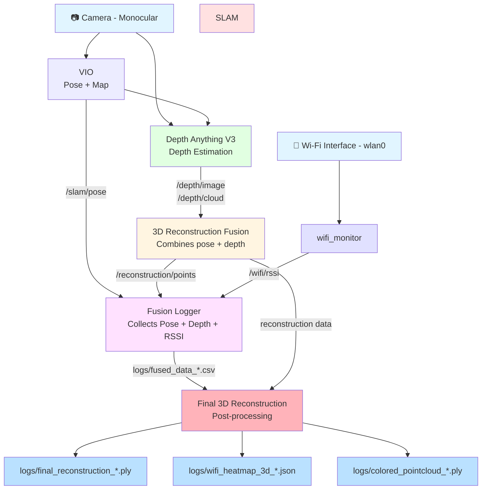
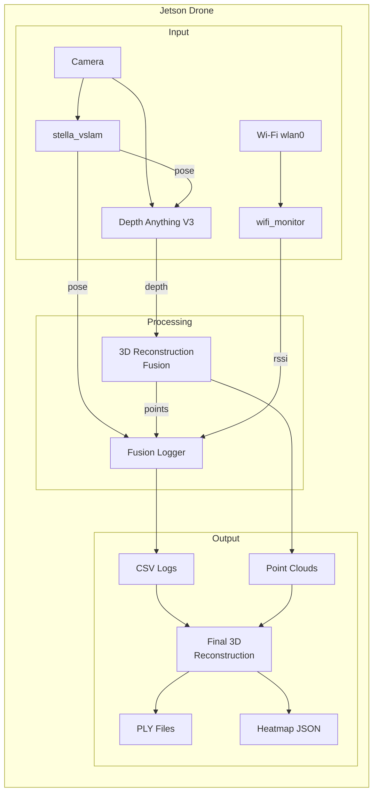
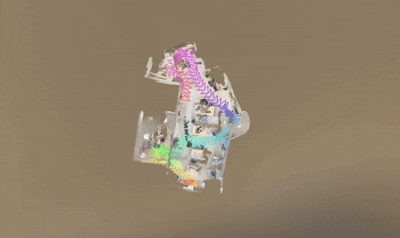
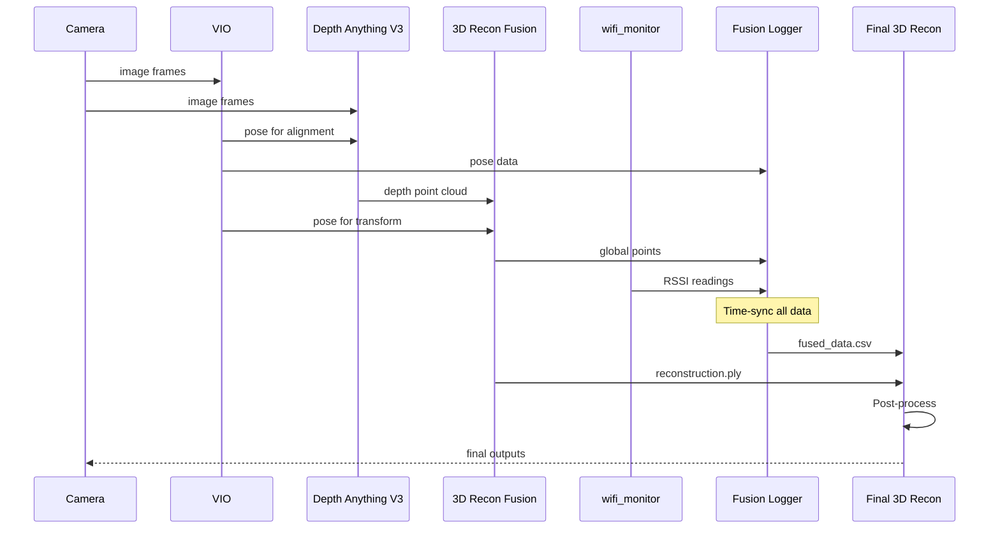
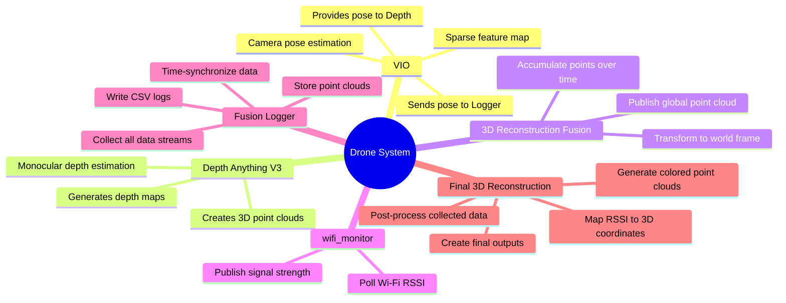
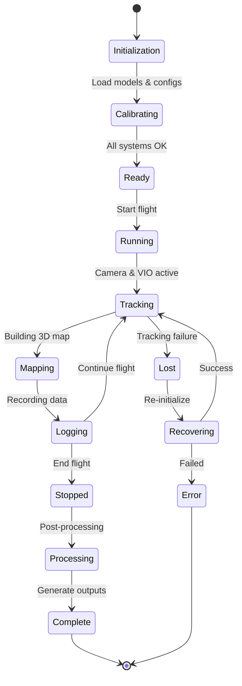

# System Architecture - Drone vSLAM + Wi-Fi RSSI Fusion

## System Architecture Diagram (Mermaid)



## Detailed Component Flow



## Demo


## Data Flow Sequence



## Component Responsibilities



## System States




## Performance Pipeline

```mermaid
gantt
    title Processing Timeline (per frame)
    dateFormat X
    axisFormat %L ms
    
    section Camera
    Image Capture: 0, 33ms
    
    section VIO
    Feature Extract: 5, 20ms
    Pose Estimate: 25, 15ms
    
    section Depth V3
    Depth Inference: 10, 80ms
    Point Cloud Gen: 90, 10ms
    
    section 3D Fusion
    Transform Points: 100, 5ms
    Accumulate: 105, 5ms
    
    section Logging
    Write Data: 110, 5ms
```



---

## How to Use These Diagrams

### On GitHub
1. Copy the entire markdown file to your repository
2. GitHub will automatically render the Mermaid diagrams
3. They will look clean and professional

### Alternative: Generate Images
```bash
# Install mermaid-cli
npm install -g @mermaid-js/mermaid-cli

# Generate PNG images
mmdc -i SYSTEM_ARCHITECTURE_MERMAID.md -o architecture.png
```

### In Documentation
- Use the Mermaid code blocks directly in README.md
- GitHub, GitLab, and many other platforms support Mermaid natively
- VS Code has Mermaid preview extensions

---

## Advantages of Mermaid Diagrams

✅ **Renders properly** on GitHub/GitLab  
✅ **Version controllable** - plain text, easy to diff  
✅ **Easy to update** - just edit the text  
✅ **Multiple diagram types** - flowcharts, sequences, state diagrams  
✅ **Professional looking** - consistent styling  
✅ **Exportable** - can convert to PNG/SVG/PDF  

---

## Original ASCII Diagram (For Reference)

The ASCII art diagram you saw uses box-drawing characters which don't render well in most markdown viewers. Instead, use the Mermaid diagrams above for clean, professional visualization.
